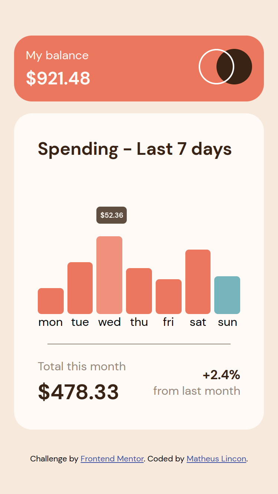
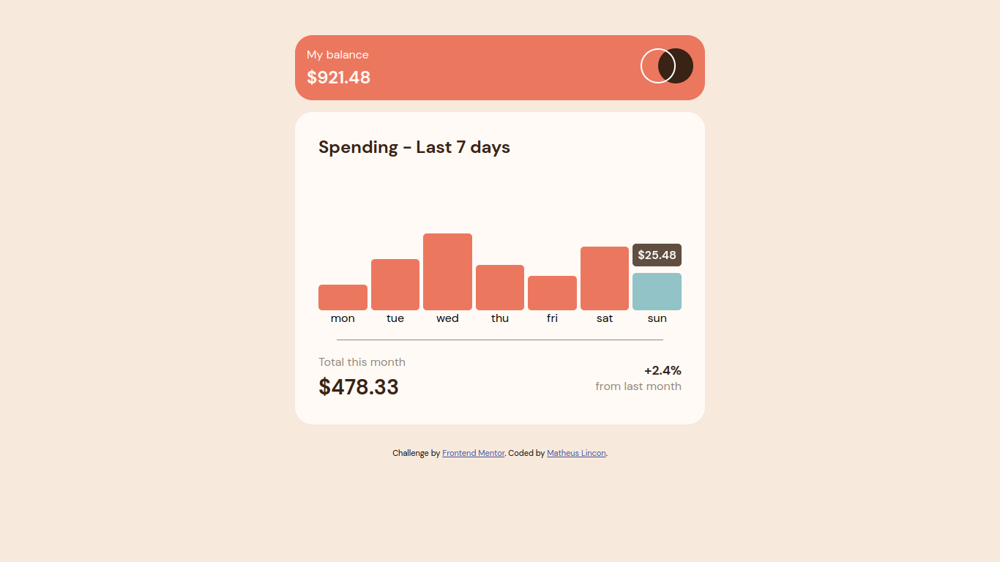

# Frontend Mentor - Expenses chart component solution

This is a solution to the [Expenses chart component challenge on Frontend Mentor](https://www.frontendmentor.io/challenges/expenses-chart-component-e7yJBUdjwt). Frontend Mentor challenges help you improve your coding skills by building realistic projects.

## Table of contents

- [Overview](#overview)
  - [The challenge](#the-challenge)
  - [Screenshot](#screenshot)
  - [Links](#links)
- [My process](#my-process)
  - [Built with](#built-with)
- [Author](#author)

## Overview

### The challenge

Users should be able to:

- :white_check_mark: View the bar chart and hover over the individual bars to see the correct amounts for each day
- :white_check_mark: See the current day’s bar highlighted in a different colour to the other bars
- :white_check_mark: View the optimal layout for the content depending on their device’s screen size
- :white_check_mark: See hover states for all interactive elements on the page
- :white_check_mark: **Bonus**: Use the JSON data file provided to dynamically size the bars on the chart

### Screenshot

### Links

- Live Site URL: [Expense Charts Component](https://matheus-lincon.github.io/expenses-chart-component/)

## My process

### Built with

- Semantic HTML5 markup
- JavaScript
  - Fetch
  - Date
  - NumberFormat (currency)
  - eventListeners
- CSS
  - Flexbox
  - CSS Grid
  - Position absolute & relative
- Mobile-first workflow

## Author

- GitHub - [matheus-lincon](https://www.github.com/matheus-lincon)
- Frontend Mentor - [@matheus-lincon](https://www.frontendmentor.io/profile/matheus-lincon)
- LinkedIn - [matheus.lincon.10010](https://www.linkedin.com/in/matheus-lincon-10010)
